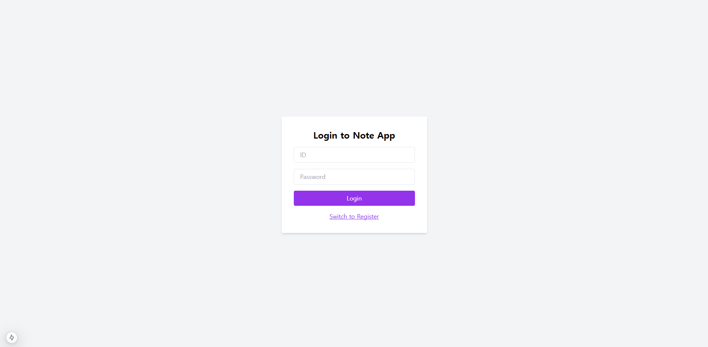
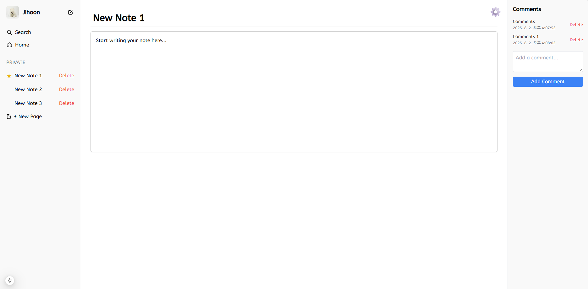
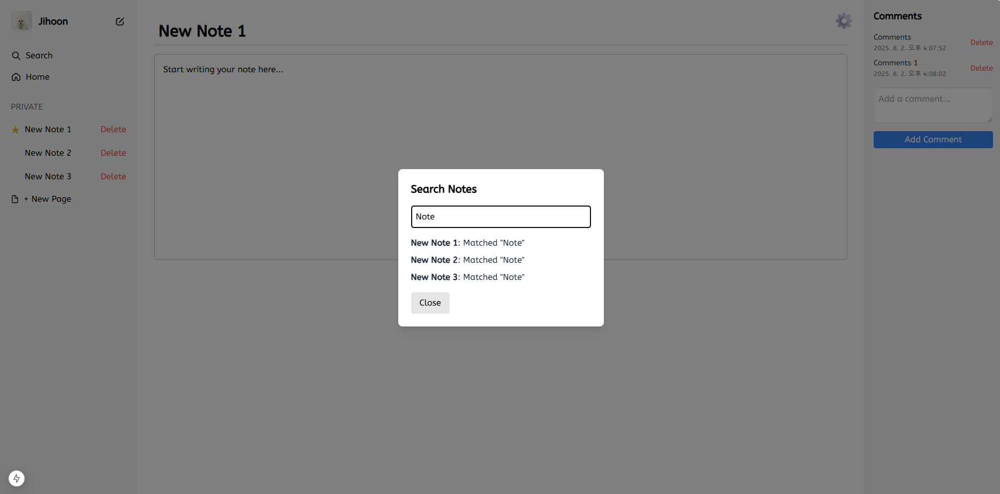
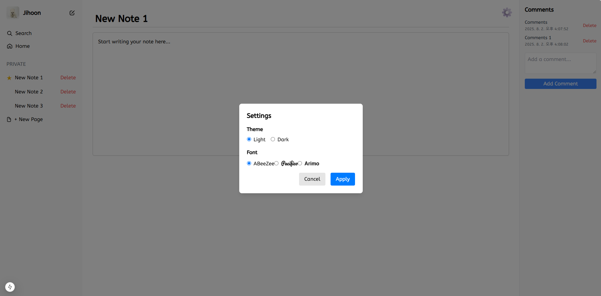

# 📝 Notepad Webpage

사용자들이 메모를 작성하고 관리할 수 있는 웹 기반 노트 애플리케이션입니다.

---
## 🖼️ 스크린샷

### 📋 로그인/가입 페이지


### 📋 메인 화면 페이지




## 📌 주요 기능

- 🔐 회원가입 및 로그인 (Register / Log in)
- 📝 노트 생성 및 삭제
- 💾 노트 내용 저장 및 검색
- 📌 노트 고정(Pin) 기능
- 💬 각 노트별 댓글(Comment) 작성
- 🧑‍💼 사용자 프로필 수정
- 🌗 Light / Dark 모드 전환
- ✍️ 다양한 글꼴(Font) 선택 기능

---

## 🛠 기술 스택

| 항목 | 기술 |
|------|------|
| 프론트엔드 | React |
| 백엔드 / ORM | Prisma (SQLite) |
| 스타일링 | Tailwind CSS |

---

## 🚀 실행 방법 (How to run code)

### 1. 프로젝트 압축 해제

먼저 프로젝트 압축을 해제한 뒤, 터미널에서 프로젝트 루트 디렉토리로 이동합니다.

### 2. 다음 명령어를 순서대로 실행합니다

```bash
npm install
npx prisma migrate dev --name init
npx prisma generate
```

### 3. 애플리케이션 실행

```bash
npm run dev
```

### 4. Prisma Studio 실행 (데이터베이스 GUI)

```bash
npx prisma studio
```
